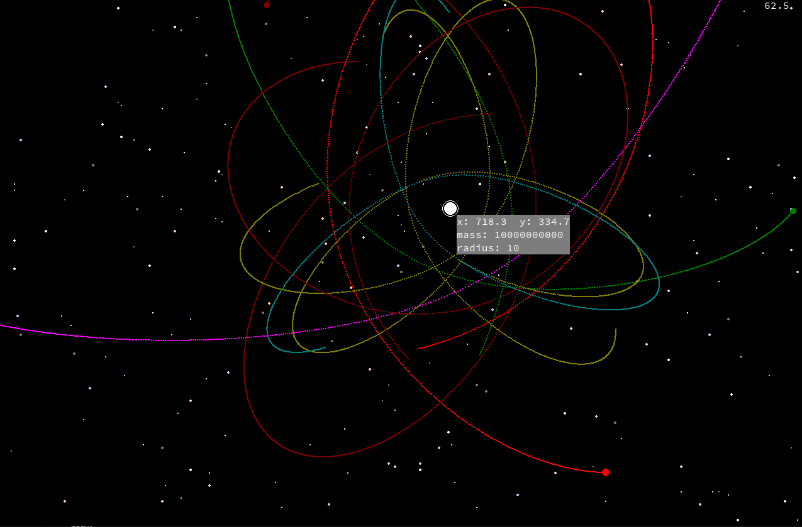

# Gravity simulation in python

You need [Python3](https://www.python.org/downloads/) and [pygame](https://pypi.org/project/pygame/)

[How to install pip packages](https://opensource.com/article/20/3/pip-linux-mac-windows)

